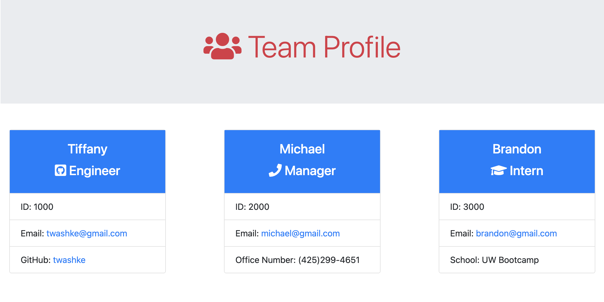

# Team Profile Generator

 

## Description

A command line application that allows the user to generate a Team Profile website using the answers provided.  Every employee card will include the employee name, role, id, and email.  Depending on the employee role, the information will either be office number (Manager), GitHub Username (Engineer), and school attended (Intern).

## Table of Contents 

- [About the Project](#about-the-project)
- [Installation](#installation)
- [Usage](#usage)
- [Contributing](#contributing)
- [Tests](#tests)
- [License](#license)
- [Questions](#questions)

## About the Project

- Created to allow the user to generate a Team Profile HTML file after answering a series of questions on the command line.
- This application is used on the command line, it includes the following npm packages: \
      - [fs](https://www.npmjs.com/package/fs) \
      - [inquirer](https://www.npmjs.com/package/inquirer) \
      - [chalk](https://www.npmjs.com/search?q=chalk)
- Each employeee card will include the following: \
      - Name - Employee name. \
      - Role - Employee role. \
      - ID - Emplyee ID Number. \
      - Email - Employee Email with link to open and send an email. \
      - GitHub Username and link to the employee's GitHub profile (for Engineer only).\
      - School attended by employee (for Intern only). \
      - Office Number of employee (for Manager).
- Once all of the employees have been entered, an HTML file will be generated with all of the employee information.
- That file can than be published to a website to keep track of the Team Profile.

## Installation

- Open command line
- run **npm install**
- run **node index.js**

## Usage

- Watch the [Test and Team Profile Generator Walkthrough](https://drive.google.com/file/d/1jJxqHaN6WONLzWTq_xPmSxGnrtdFn7HX/view?usp=sharing) for instructions.
- [Sample index.html](dist/index.html) created in walkthrough above.
- Follow installation instructions above (open command line, and run npm install and run node index.js).
- Answer questions when prompted for employee.
- The last question will be about adding additional employees, answer "Yes" to add another employee.
- Once all employees have been entered, answer "No" to generate the Team Profile HTML file.

Team Profile Website Example

## Contributing

- No contributions have been made to the project at this time.
- Any and all contributions are welcome.

## Tests

- Make sure the npm install command has been done to load all packages required.
- npm run test
- Four tests created: \
      - [Employee.test.js](test/Employee.test.js) \
      - [Engineer.test.js](test/Engineer.test.js) \
      - [Intern.test.js](test/Intern.test.js) \
      - [Manager.test.js](test/Manager.test.js) 
- All tests passed, results can be seen below: \

## License

This application is covered by the [MIT License](https://opensource.org/licenses/MIT). 
       
      Copyright 2021 Tiffany Washke

      Permission is hereby granted, free of charge, to any person obtaining a copy of this software and associated documentation files (the "Software"), to deal in the Software without restriction, including without limitation the rights to use, copy, modify, merge, publish, distribute, sublicense, and/or sell copies of the Software, and to permit persons to whom the Software is furnished to do so, subject to the following conditions:
      
      The above copyright notice and this permission notice shall be included in all copies or substantial portions of the Software.
      
      THE SOFTWARE IS PROVIDED "AS IS", WITHOUT WARRANTY OF ANY KIND, EXPRESS OR IMPLIED, INCLUDING BUT NOT LIMITED TO THE WARRANTIES OF MERCHANTABILITY, FITNESS FOR A PARTICULAR PURPOSE AND NONINFRINGEMENT. IN NO EVENT SHALL THE AUTHORS OR COPYRIGHT HOLDERS BE LIABLE FOR ANY CLAIM, DAMAGES OR OTHER LIABILITY, WHETHER IN AN ACTION OF CONTRACT, TORT OR OTHERWISE, ARISING FROM, OUT OF OR IN CONNECTION WITH THE SOFTWARE OR THE USE OR OTHER DEALINGS IN THE SOFTWARE.

## Questions

**Contact Tiffany Washke**

- **Email directly at** twashke@gmail.com
- **GitHub User Name:** [twashke](https://github.com/twashke)

 

